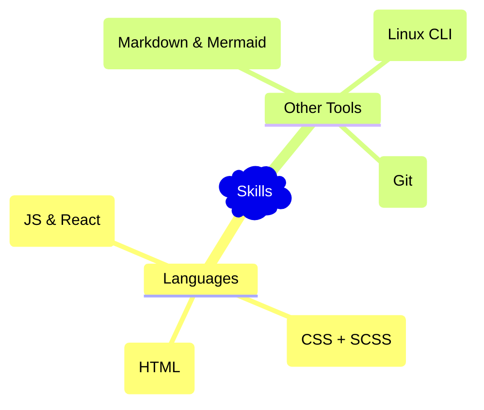

- 👋 Hi, I’m @matthewJull
- 🌱 I’m currently learning frontend (React) & fullstack (nodeJS) development
- 💞️ I’m looking to collaborate on interesting web-based projects

### You can check my projects here:
- https://matthewjull.github.io/odin-recipes

_________________________________________________________________________________

