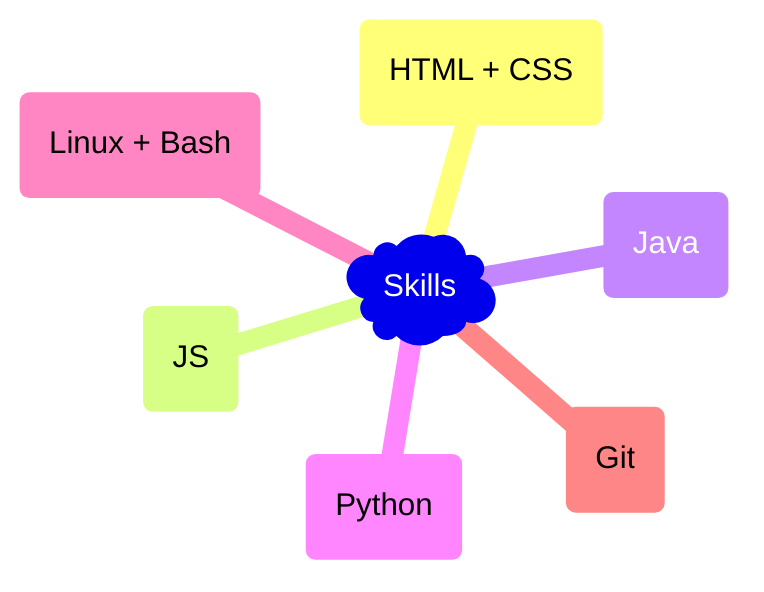

- 👋 Hi, I’m @matthewJull, an IT teacher/enthusiast.
- 🌱 I’m eager to collaborate on interesting projects!

### You can check my projects here:
- https://matthewjull.github.io/odin-recipes

_________________________________________________________________________________

